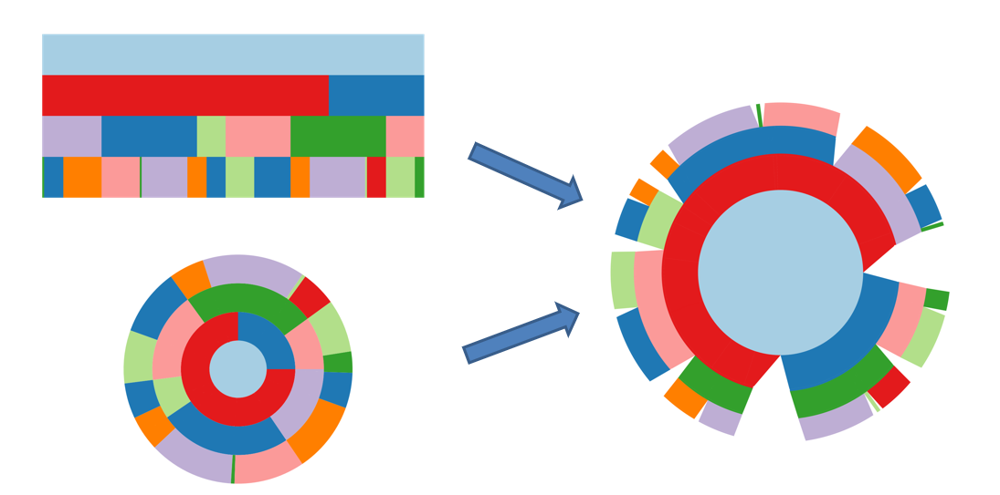

# Radial-Icicle-Tree (RIT)
A brief tutorial for the paper "Radial Icicle Tree (RIT): Node Separation and Area Constancy"

The **Radial Icicle Tree (RIT)**, which transforms the rectangular bounding box of an icicle tree into a circle, circular sector, or annular sector
while introducing gaps between nodes and maintaining area constancy for nodes of the same size. We applied this new visual design to some datasets. 



## Overview
Currently, we have made four tutorial files to illustrate the design ideas in the paper. The **Tutorial I** document shows what synthetic data looks like under the RIT diagram. 
The **Tutorial II** document explains how to draw more layers of RIT on the basis of **Tutorial I**. The **Tutorial III** and **Tutorial IV** are the applications of RIT on two public datasets.

## Installation

The code requires Python >= 3.8  
NumPy: 1.19.5  
Matplotlib: 3.2.2  
Pandas: 1.1.5.  

if not please use:
```
pip install numpy
pip install matplotlib
pip install pandas
```

Recommend:
The code can also be directly used in Google Colab.

## License

RIT code released under the Apache License 2.0. See [LICENSE](LICENSE) for additional details.

## Citing RIT ٩(๑>◡<๑)۶

If you find this repository useful, please consider giving a star :star: and citation:

```
@misc{jin2023radial,
      title={Radial Icicle Tree (RIT): Node Separation and Area Constancy}, 
      author={Yuanzhe Jin and Tim J. A. de Jong and Martijn Tennekes and Min Chen},
      year={2023},
      eprint={2307.10481},
      archivePrefix={arXiv},
      primaryClass={cs.HC}
}
```
