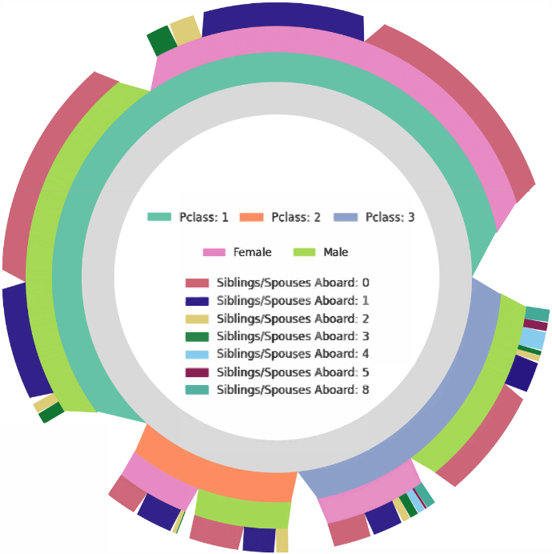

# Radial-Icicle-Tree (RIT)
A brief tutorial for the paper "Radial Icicle Tree (RIT): Node Separation and Area Constancy"

The **Radial Icicle Tree (RIT)**, which transforms the rectangular bounding box of an icicle tree into a circle, circular sector, or annular sector
while introducing gaps between nodes and maintaining area constancy for nodes of the same size. We applied this new visual design to some datasets. 


## Overview
Currently, we have made four tutorial files to illustrate the design ideas in the paper. The **Tutorial I** document shows what synthetic data looks like under the RIT diagram. 
The **Tutorial II** document explains how to draw more layers of RIT on the basis of **Tutorial I**. The **Tutorial III** and **Tutorial IV** are the applications of RIT on two public datasets.

## Installation

The code requires Python >= 3.8  
NumPy: 1.19.5  
Matplotlib: 3.2.2  
Pandas: 1.1.5.  

if not please use:
```
pip install numpy
pip install matplotlib
pip install pandas
```

Recommend:
The code can also be directly used in Google Colab.


## Examples of Applications:
In the paper, we used the Titanic dataset, a well-known dataset containing demographic and survival information about passengers aboard the Titanic. This dataset has a hierarchical structure suitable for RIT visualization. The results can be found below:


This application showcases RIT’s potential for presenting structured datasets in a format that is both compact and perceptually informative.

## Suggested Ideas to Collaborators:
If you are a researcher (e.g., in digital humanities, cultural analytics, or human-computer interaction):  

- Explore how RIT can support hierarchical analysis of cultural, historical, or any structured based dataset.

- Collaborate on case studies that apply RIT to domain-specific datasets (e.g., literary character networks, historical timelines, etc.), and evaluate how radial layouts affect users' cognitive load and pattern recognition.

If you are a developer(especially with a background in data visualization, digital archives, or humanities tool development):  
- Integrate RIT into existing digital humanities platforms or visualization dashboards to enhance tree-based visual exploration.

- Extend the current codebase with interactive features for exploration of hierarchical humanities datasets with many layers or nested categories.


## License

RIT code released under the Apache License 2.0. See [LICENSE](LICENSE) for additional details.

## Citing RIT ٩(๑>◡<๑)۶

If you find this repository useful, please consider giving a star :star: and citation:

```
@article{Jin:2023:VIS,
author = {Jin, Yuanzhe and de Jong, Tim J. A. and Tennekes, Martijn and Chen, Min},
title = {Radial Icicle Tree (RIT): Node Separation and Area Constancy},
year = {2023},
issue_date = {Jan. 2024},
publisher = {IEEE Educational Activities Department},
address = {USA},
volume = {30},
number = {1},
issn = {1077-2626},
url = {https://doi.org/10.1109/TVCG.2023.3327178},
doi = {10.1109/TVCG.2023.3327178},
abstract = {Icicles and sunbursts are two commonly-used visual representations of trees. While icicle trees can map data values faithfully to rectangles of different sizes, often some rectangles are too narrow to be noticed easily. When an icicle tree is transformed into a sunburst tree, the width of each rectangle becomes the length of an annular sector that is usually longer than the original width. While sunburst trees alleviate the problem of narrow rectangles in icicle trees, it no longer maintains the consistency of size encoding. At different tree depths, nodes of the same data values are displayed in annular sections of different sizes in a sunburst tree, though they are represented by rectangles of the same size in an icicle tree. Furthermore, two nodes from different subtrees could sometimes appear as a single node in both icicle trees and sunburst trees. In this paper, we propose a new visual representation, referred to as <italic>radial icicle tree</italic> (RIT), which transforms the rectangular bounding box of an icicle tree into a circle, circular sector, or annular sector while introducing gaps between nodes and maintaining area constancy for nodes of the same size. We applied the new visual design to several datasets. Both the analytical design process and user-centered evaluation have confirmed that this new design has improved the design of icicles and sunburst trees without introducing any relative demerit.},
journal = {IEEE Transactions on Visualization and Computer Graphics},
month = {oct},
pages = {251–261},
numpages = {11}
}
```
